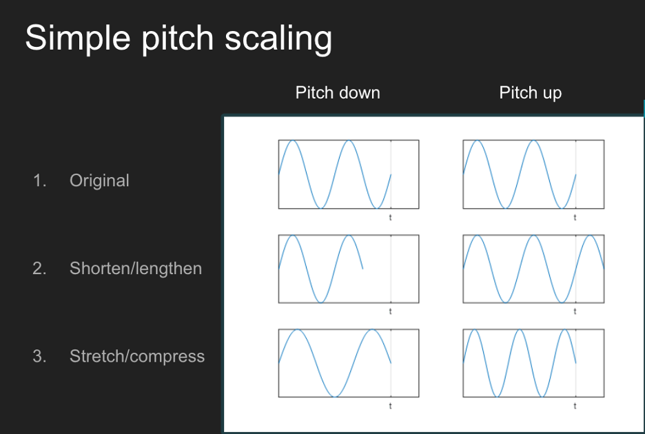
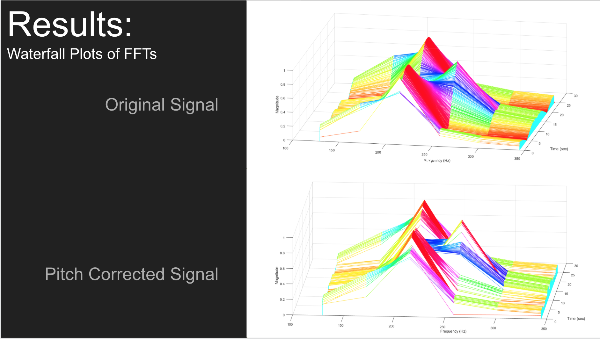
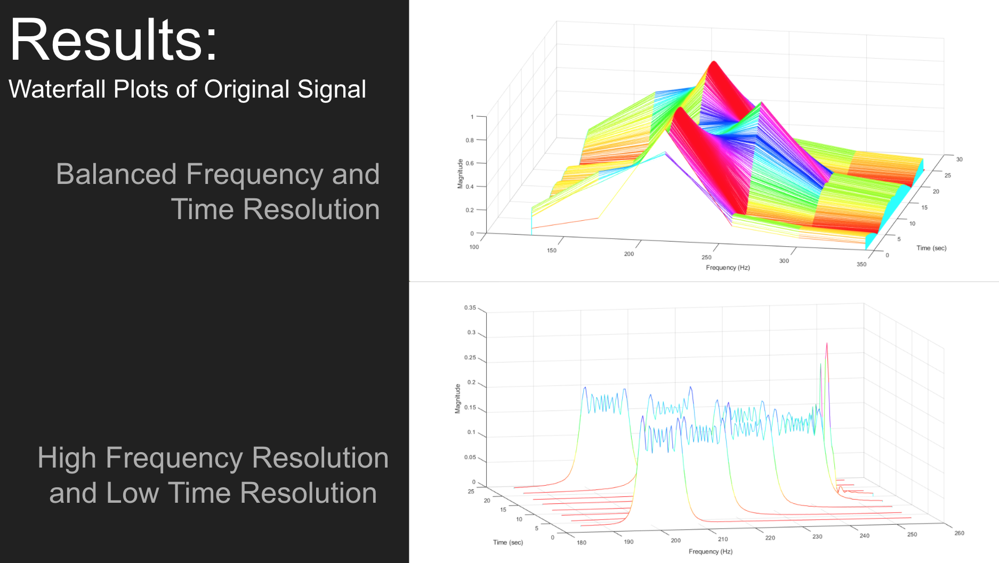
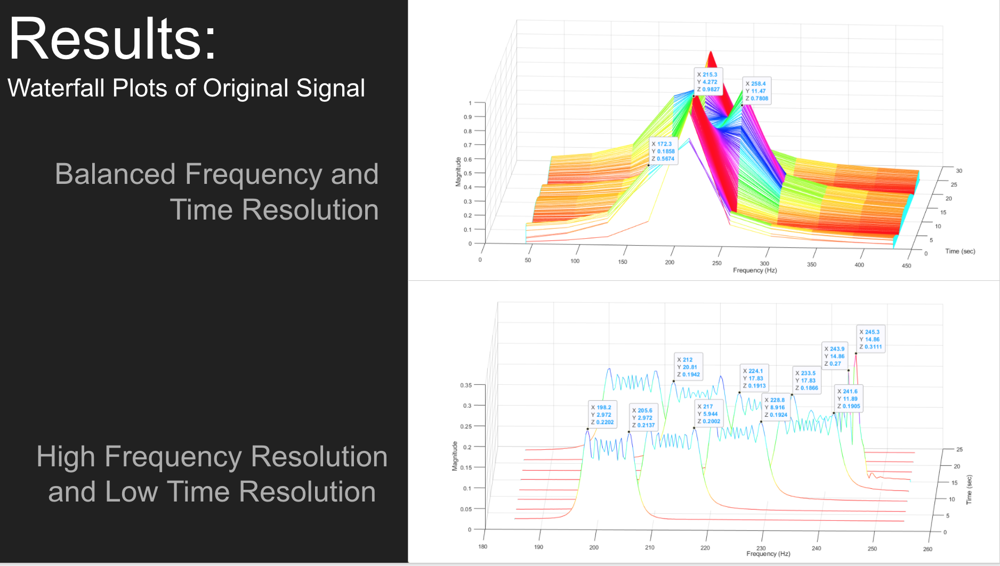
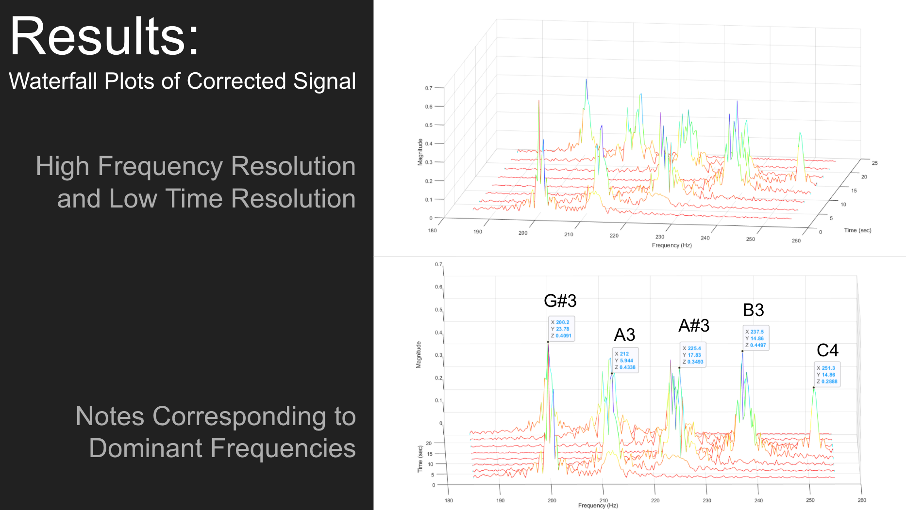
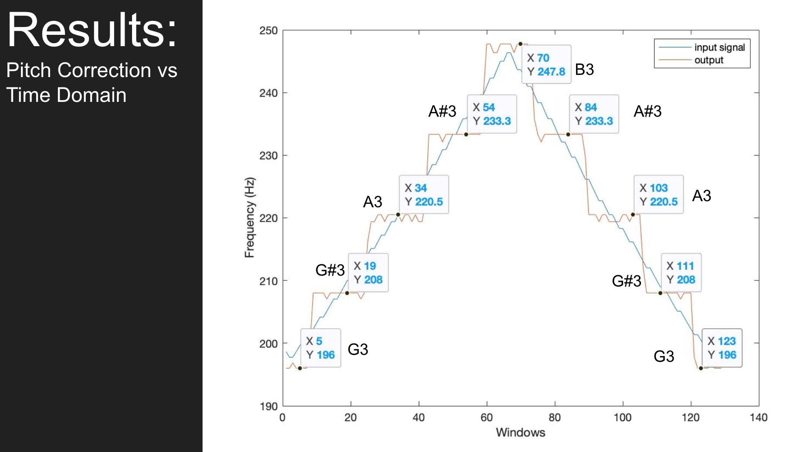

#  Pitch Correction (autotune) in MATLAB


## By DSP People 
### John Gearig, Derek LaFaive, Marlon Greene, Randall Schliebe
----------------------------------------------------------------
## Introduction

Hello! We are the DSP people. We are a group of Michigan electrical engineers who were tasked with developing software to display our knowledge of digital signal processing. 

As you know, singing is an incredibly difficult task, but singing the correct pitch at all times is even harder. Our groups’ goal was to develop an algorithm that would make this task much simpler. 

At a high level, our algorithm takes in an audio signal as the argument along with several customizable parameters, and outputs a pitch corrected version of the input signal. 


## Algorithm

At its core, “pitch” is a perceptual quality of an audio signal; that is, it has to do with how humans interpret the highness or lowness of a note. Thus, pitch correction aims to meet human perception of sound. While pitch can reasonably be quantified by the fundamental frequency of a signal, pitch correction is not possible by merely shifting the fundamental frequency to the desired level. Audio signals are typically composed of many layered frequencies, i.e., harmonics, so pitch correction requires proportional adjustment of all frequencies of the signal. This can be accomplished by first lengthening or shortening a signal without changing its pitch and then stretching or shrinking it back to its original size, thus altering pitch.

Our algorithm operates with discrete audio data sampled at some finite frequency. To shorten an input audio signal without altering pitch, our algorithm concatenates it by removing later data points. To lengthen a signal, it pulls data points from the “future,” that is, data points from a later time that it has received but not yet processed. To stretch a signal to its original length, our algorithm evenly spreads the remaining data points over the length of the original signal, and it fills gaps via linear interpolation. To shrink signals, our algorithm periodically removes data points.



##  Functions
### Here is a brief description of each MATLAB file that we developed!

To view complete code on Github, click [here](https://github.com/johngear/DSP)

### Dashboard.m

The dashboard file is the only file that a user should ever interface with during most situations. This file allows the user to select the values for various filter parameters without having to dive into the lower levels of our code. After inputting the filter parameters, the liveProcessing function is called which performs signal modifications described by the user’s parameters and returns the original signal and modified signal. At the bottom of this file there are options to playback the input and output audio and to graphically compare the main pitch of each signal over time. 

```markdown
##Stereo file to be modified. Ex: 'dsp_SONG.wav'
input_file = 'drone.wav'; 

##Size of the window in frames. Each frame has 1024 samples 
window_size = 10; 

##Overlap percentage in decimal form (20% overlap = .2)
overlap = .2;

##fade length in number of samples per fade-in and fade-out
fade_length = 128;

##Call processing function and saving the input and output
[input,output] = liveProcessing(input_file,window_size,overlap,fade_length);
```

### liveProcessing.m

The liveProcessing function takes in the user’s parameters selected in the dashboard and outputs the original input vector and the modified output vector. First, this function creates musical “bins”. A bin is essentially a range of frequencies that correspond to a specific note.for example, an A3 is supposed to be 220 Hz, so if we create a bin that ranges from 213-226Hz , we know that  all frequencies in that range should really be an A3. After developing the musical bins, this function iterates through the input file frame-by-frame and passes windows of samples to the other functions so that they can perform the necessary modifications. 

### Tune.m

The Tune function takes in the user’s defined parameters along with a new frame of audio from liveProcessing. This function is called every time that the liveProcessing function receives a new frame. After receiving enough frames to make the desired window length, the Tune function will begin to modify the audio.

With a full window of audio data, the Tune function begins by determining the pitch of the audio. It determines pitch by finding the fundamental frequency of the windowed signal. This function then feeds this frequency to the Bins function, acquiring the desired frequency shift.

The Tune function only corrects a segment of the windowed signal--to the point of the overlap with the next window. To shift the pitch of the segment of signal, the Tune function first extends or concatenates the signal according to the desired frequency shift, effectively changing the signal’s length without changing its pitch. It then stretches or shrinks the signal back to its original size, changing the audio’s pitch. 

Once the Tune function has modified the signal, it returns the corrected segment of signal while preserving the current window’s overlap into the next window.


### mainFreqIdent.m 

This function is responsible for identifying how far off the audio’s frequency is from the desired frequency of the nearest musical note. This function will take in the fundamental frequency of the input audio and return what the necessary frequency shift is to reach the desired frequency. 


### sigFade.m

The sigFade function takes in the new audio signal and a fade length (chosen by the user in dashboard.m) and performs a fade-in and fade-out manipulation. Essentially this function just attenuates the beginning and end of each window so that the final output signal doesn’t have any audio clicking. This function returns the new audio signal with the necessary attenuation. 

### plotFreq.m

The plotFreq function takes in the input and output vectors along with a few other user defined parameters to graph our filter’s functionality. This function plots the fundamental pitch of the input and the output vs. time. This function can be called at the end of dashboard.m by uncommenting a few lines of code. 

## Results 


In order to evaluate the effectiveness of our algorithm, we analyzed our output signal using both graphical and auditory methods. Our first graphical assessment required the waterfall plots (Irvine, 2006) of the input and output FFTs. For those unfamiliar with the waterfall plot, it provides similar information compared to a spectogram.

As you can see, our pitch correction clearly shifts the frequency spectra of the original signal, concentrating at two major frequencies.



However, we require more information about the frequencies present within the signal. This leads to our plot of the original signal with high frequency resolution (meaning a small delta f).



Based on our higher resolution, it is apparent that our original signal consists of a few frequency bands, most of which having a bandwidth between 5 and 10 Hz.



After correcting the signal, we can observe that the bandwidths have been altered drastically. The effective bandwidths for each band are smaller overall, and more emphasis is placed on the desired frequency (or musical note) from the frequency bins.



In addition, we plotted the pitch of the input signal (which is linearly increasing and decreasing over time) and compared it to the output signal pitch. It is evident that the algorithm generally shifts frequencies to their correct notes based on the frequency bin.

Based on the graphs shown previously, our algorithm is shifting with relatively high precision and accuracy. However in practice, this difference isn’t the most effective to the listener. In fact our group discovered a bit of a paradox, where our data looked promising (A.K.A shifted correctly) but sounded a bit lackluster in comparison to the ineffective shifts with drastically different sound. Some of these issues may lie within our code; however much of these issues show that audio analysis can be subjective. 


## References
Tom Irvine (2020). Waterfall FFT (https://www.mathworks.com/matlabcentral/fileexchange/7463-waterfall-fft), MATLAB Central File Exchange. Retrieved April 8, 2020.

Nagel, Ashley. “Methods.” It's Just A Little Pitch Correction - DSP Final Project by A. Nagel, www.columbia.edu/~agn2114/methods.html.
