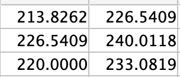

# DSP site made by John

# Live Pitch Correction (auto-tune) in Matlab

## By DSP People


# Introduction:

Hello! We are the DSP people. We are a group of Michigan electrical engineers who were tasked with developing software to display our knowledge of digital signal processing. 

As you know, singing is an incredibly difficult task, but singing the correct pitch at all times is even harder. Our groups’ goal was to develop an algorithm that would make this task much simpler. 

At a high level, our algorithm takes in an audio signal as the argument along with several customizable parameters, and outputs a pitch corrected version of the input signal. 




You can use the [editor on GitHub](https://github.com/johngear/DSP/edit/master/README.md) to maintain and preview the content for your website in Markdown files.

Whenever you commit to this repository, GitHub Pages will run [Jekyll](https://jekyllrb.com/) to rebuild the pages in your site, from the content in your Markdown files.

### Markdown

Markdown is a lightweight and easy-to-use syntax for styling your writing. It includes conventions for

```markdown
Syntax highlighted code block

# Header 1
## Header 2
### Header 3

- Bulleted
- List

1. Numbered
2. List

**Bold** and _Italic_ and `Code` text

[Link]("https://johngear.github.io/DSP/") and 
```

[Image](bins_image.png)

For more details see [GitHub Flavored Markdown](https://guides.github.com/features/mastering-markdown/).

### Jekyll Themes

Your Pages site will use the layout and styles from the Jekyll theme you have selected in your [repository settings](https://github.com/johngear/DSP/settings). The name of this theme is saved in the Jekyll `_config.yml` configuration file.

### Support or Contact

Having trouble with Pages? Check out our [documentation](https://help.github.com/categories/github-pages-basics/) or [contact support](https://github.com/contact) and we’ll help you sort it out.
